# The AI Integration Layer Is Becoming the New Backend

Backend development has always been the part of software where product behavior becomes enforceable.

The backend manages identity, permissions, data storage, business logic, background jobs, APIs, and third-party integrations. It is where product rules become systems that customers can actually use.

With AI products, that baseline stays in place.

The added backend work sits around the LLM and the agent using it.

An AI product has to retrieve the right customer context, preserve source permissions, decide which tools an agent can use, execute those tool calls safely, route requests across models, track cost, log what happened, and give teams a way to audit the system.

That sounds like a lot, right? Yes It is. This work lives between the product, the LLM, the agent, and the customer's business systems. Let's call it the **AI integration layer.**

You can describe the underlying architecture in three paths:

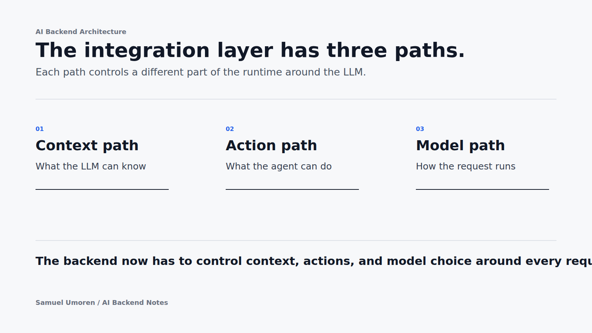

In this piece, i'll be referencing Merge.dev. Merge builds integration infrastructure for companies that need to connect their products to customer systems. Its recent product direction extends that work into AI infrastructure: [Unified](https://www.merge.dev/blog/the-new-merge) handles synced business context, [Agent Handler](https://docs.merge.dev/merge-agent-handler/overview) handles governed tool execution, and [Gateway](https://docs.merge.dev/merge-gateway/features/routing-policies/overview) handles model routing, observability, and control.

Put differently: the integration layer is becoming the backend around the LLM.

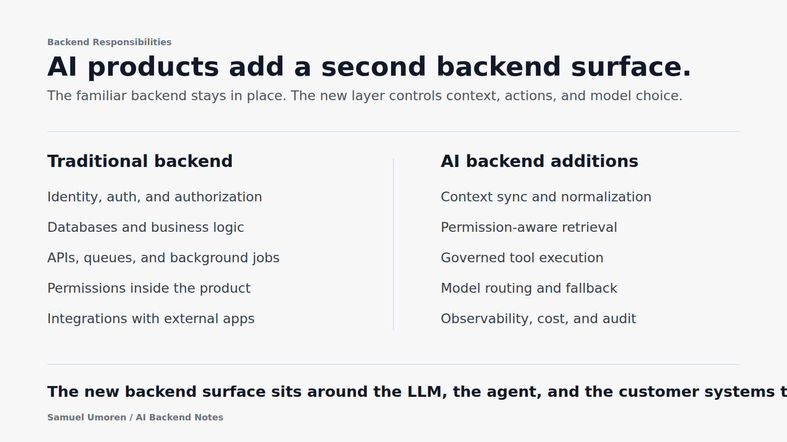

## AI products add a second backend surface

A traditional SaaS backend usually has a familiar set of responsibilities:

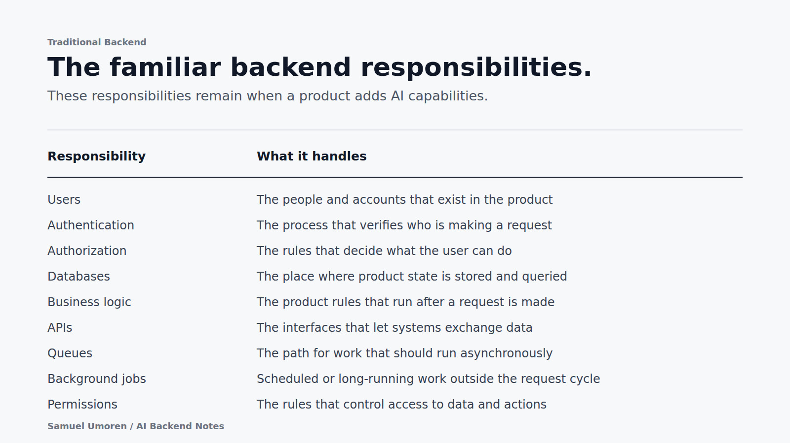

When a product adds AI capabilities, these responsibilities remain.

Then the AI layer introduces another set of runtime responsibilities:

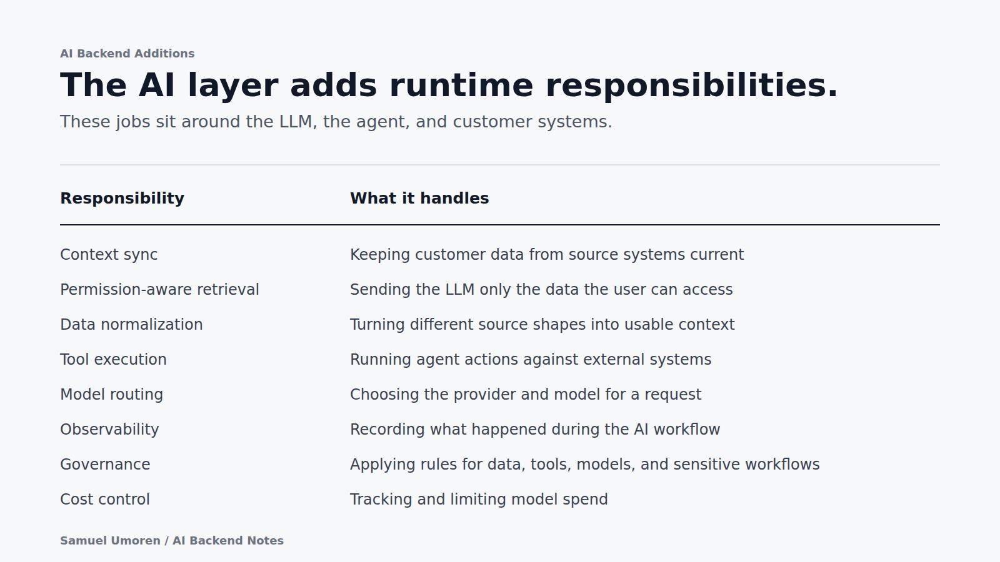

AI products need these responsibilities because they interact with customer systems differently from traditional applications.

A traditional app usually exposes a workflow through screens, forms, buttons, and API calls. The user performs the action and then the backend validates it, writes data, and records the result.

With agents, the workflow is compressed because the agent reads context, chooses an action, calls a tool, and generates a response in one flow. The system has to control what the LLM can know, what the agent can do, which provider/model should handle the request, and how each step is recorded.

Merge abstracts this architecture:

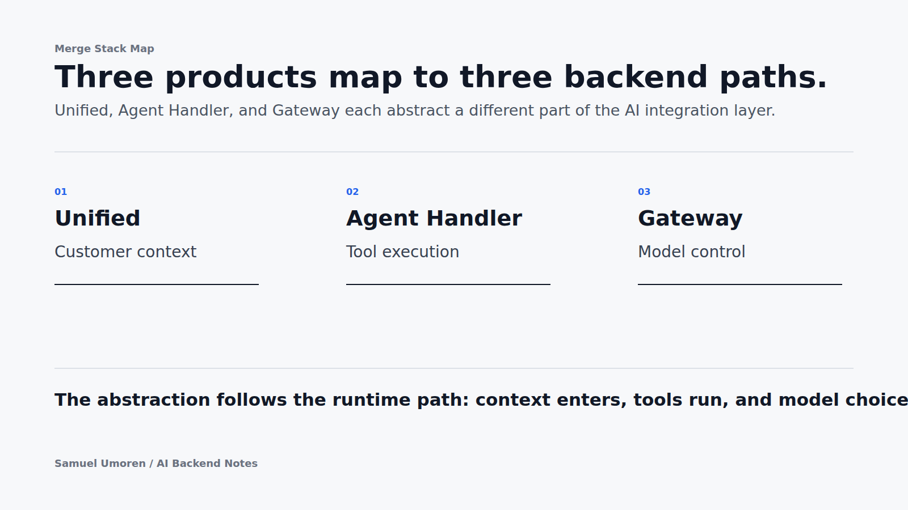

Use this map as the frame for the rest of the article.

## AI products need context that stays synced

Large language models (LLMs) know a lot about public information because they are pretrained on large corpora. But they do not automatically know the current state of a customer's Salesforce account, Zendesk escalation, Jira issue, Slack thread, Confluence page, Notion workspace, or Linear project.

Enterprise AI products need this data because the user is usually asking about a live business situation. For instance:

- why is this customer blocked?
- what changed in this project?
- which support policy applies to this context?
- what issue should be created from this escalation?

The challenge here is data freshness. Customer context changes across tickets, docs, permissions, and account records. A support escalation that was accurate yesterday can become stale after one internal comment from an account manager.

By the time the user asks, the product already needs a current view of the customer's systems. So context retrieval starts before the prompt.

As a result, the system must connect to source apps, sync data, normalize objects, track updates, and preserve enough source metadata for downstream workflows. [Unified APIs](https://www.merge.dev/blog/the-new-merge) describe this layer as reliable integrations, normalization, ongoing sync infrastructure, and correct permissioning across third-party applications.

A knowledge base makes this concrete because document systems do not behave like a clean folder tree. The integration has to preserve enough structure for retrieval while simplifying the data enough for the AI product to use. Merge's [Knowledge Base Unified API announcement](https://www.merge.dev/blog/knowledge-base-unified-api-announcement) describes the constraints:

- pages can be deeply nested
- pages can be cross-linked
- folder hierarchies can change
- customers ask for all content or only selected workspaces
- providers enforce rate limits
- documents carry different permissions inside the same hierarchy

Together, those constraints create a modeling problem: hence, an integration has to turn messy source knowledge into a usable representation for the AI product.

This model also has to fit the workflow using it.

For example, a CRM system exposes account fields, contact fields, opportunity fields, and support fields as separate objects. A sales assistant needs those fields composed into a compact account context: renewal status, open opportunities, support escalations, usage signals, and the next recommended action.

[AI Data Transformations](https://www.merge.dev/blog/ai-data-transformations) fit into this part of the architecture. Synced data often needs field mapping, cleanup, derived fields, custom business logic, and workflow-specific formatting before it becomes usable context.

The context layer turns source-system data into workflow-ready context.

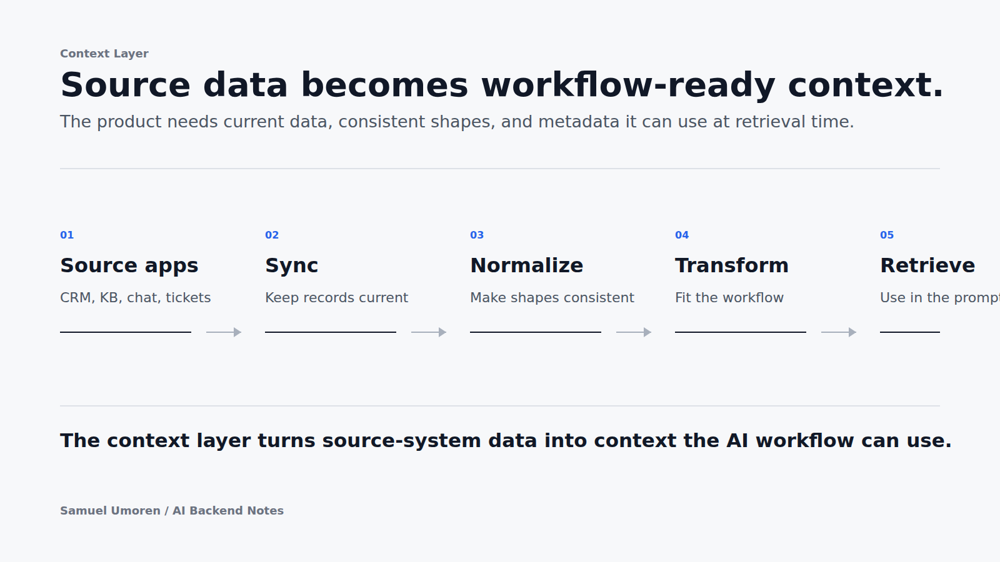

## Permissions have to follow derived knowledge

Enterprise AI products need permission-aware context because AI systems transform source content into new forms.

The nuance: the user often sees the derived object, not the raw source.

AI systems do not leave source content in its original form. They turn documents, Slack messages, support tickets, and meeting transcripts into summaries, tasks, risk signals, decision records, and generated answers.

The context path is the route source data takes before it reaches a user-facing surface:

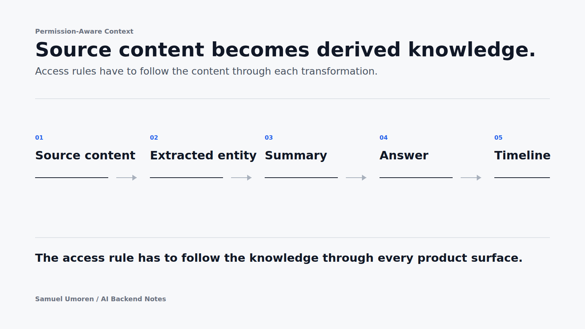

Each step preserves the substance of the original content. The access rules need to travel with that substance.

I ran into this pattern while working on an internal graph-based knowledge system. Source content does not stay in its raw form. It becomes structured knowledge: decisions, tasks, risks, summaries, and answer context. The product needed to know where each derived object came from so the same access rules could apply after transformation.

This becomes concrete when the source is private.

If a private Slack message becomes a decision in the product, a user who cannot access the source message should not see the derived decision. If that decision appears inside a summary, timeline, or generated answer, the same rule still applies.

That means the product needs provenance:

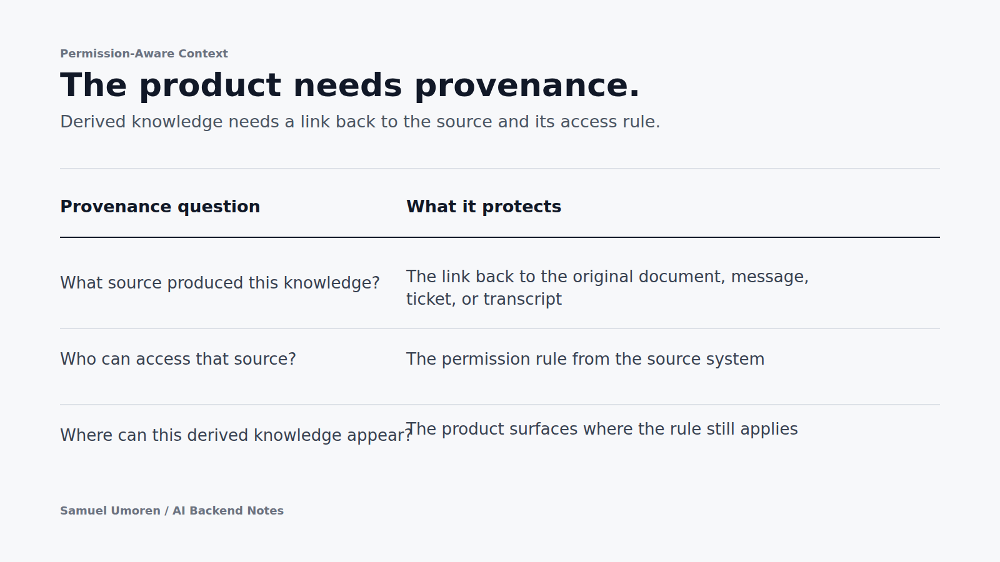

Due to this, Knowledge Base ACLs sit close to the center of enterprise AI systems. A search or agent system can retrieve the correct information and still be unusable if it returns information the current user cannot access.

Permission-aware retrieval gives the LLM context the user is allowed to see.

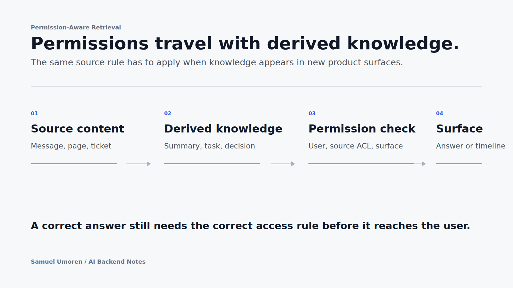

## Agents need governed tool execution

Once the product has context, the next challenge is **action**. Context lets an AI product answer. Tools let it act.

Agents need backend controls because they act inside another system for a user. The product has to know the user, the connected account, the granted scopes, the available tools, and the result of the external app call.

[Agent Handler](https://docs.merge.dev/merge-agent-handler/overview) frames this around MCP-ready connectors, Tool Packs, per-user or group auth, DLP checks, tool-call logs, audit trails, and enterprise governance.

Here are the terms in context:

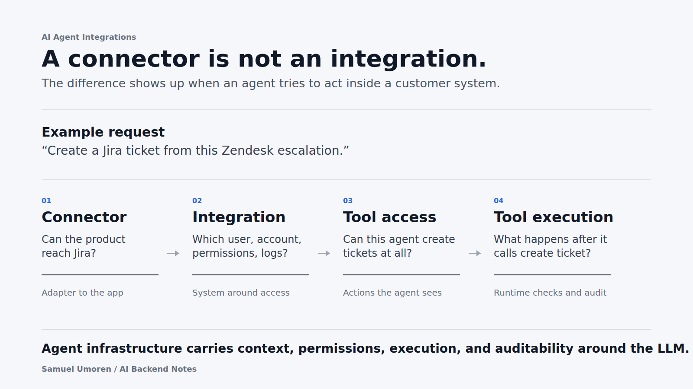

A **connector** gives the product a way to talk to an external app. For instance, a Jira connector exposes tools to search issues, create tickets, update issues, or add comments.

**Tool access** defines the action surface available to one agent. A support agent is allowed to search Jira and create issues, while delete access and project settings stay outside that agent's surface.

**Tool execution** happens when the agent uses one of these actions. At that point, the system checks the user, account, scopes, workspace, and arguments. Then it records the provider response, logs, and audit trail.

**Integration** is the full production system around the tool call.

Take a simple workflow: a customer asks an AI agent to create a Linear issue from a support escalation.

The product needs a sequence:

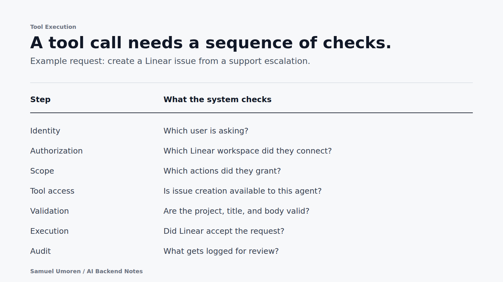

A Tool Pack defines the action surface for one agent. A support agent gets support-safe tools. A revenue-ops agent gets CRM write tools. An internal employee assistant gets calendar tools.

From the user's side, this looks like a normal conversation in the product. Behind that conversation, the backend is checking identity, scopes, tools, policy, execution, logs, and audit.

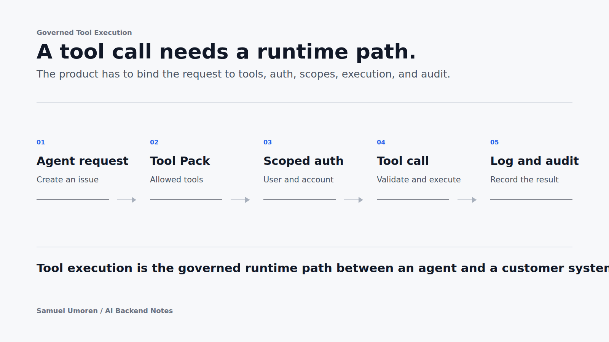

## Connectors become part of production reliability

Once an agent uses tools to perform work inside customer systems, connector behavior becomes product behavior.

Merge's article on [building reliable MCP connectors](https://www.merge.dev/blog/how-we-build-mcp-connectors) opens with a direct failure mode: "faulty connectors can prevent agents from executing actions or cause them to execute the wrong actions."

This failure can appear in three places:

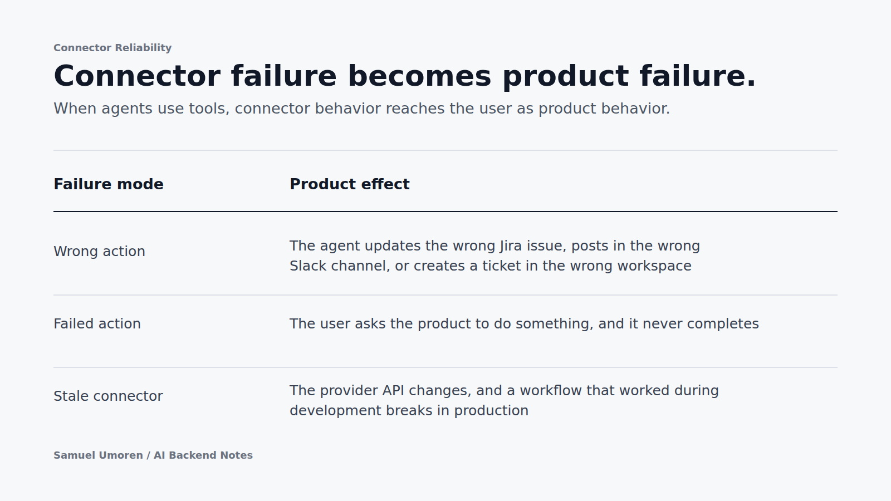

To prevent those failures, the connector has to describe each tool clearly. That starts with the tool schema.

A tool is the action a connector exposes to an agent. In the [MCP connectors explainer](https://www.merge.dev/blog/mcp-connectors), this is the unit the agent chooses from. For that choice to work, each tool needs a clear name, a useful description, required arguments, optional arguments, and expected data formats.

For an LLM, the schema is an interface contract. The model uses that contract to choose the action and construct the call.

Testing also has to reflect agent workflows. Merge says it compares connectors against official MCP servers by running representative workloads across both implementations and measuring latency, hit rates, and success rates across repeated runs.

The reliability loop looks like this:

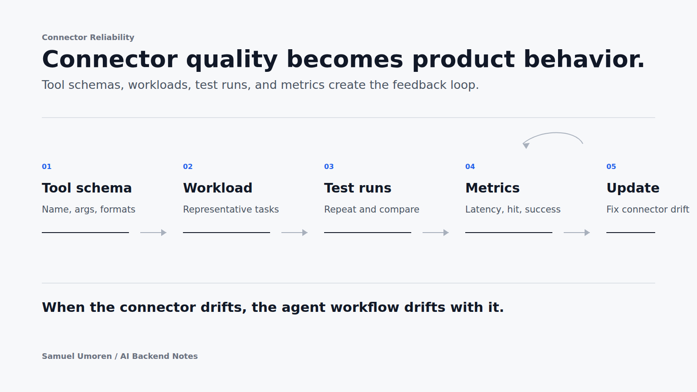

A broken connector creates a broken action. The failure reaches the user as product behavior. You want to avoid this by all cost.

## Model routing belongs in the control plane

At production scale, AI products also need control over model selection. You do not want to spend premium-model money on a task a cheaper model can handle well. You also do not want to route a sensitive or complex workflow to a model that cannot meet the quality bar.

Different requests have different requirements: cost, latency, quality, uptime, customer tier, and governance. A support-ticket summary, a regulated compliance analysis, and a high-volume background classifier should not always follow the same model path.

The control-plane idea is to move model choice into policy:

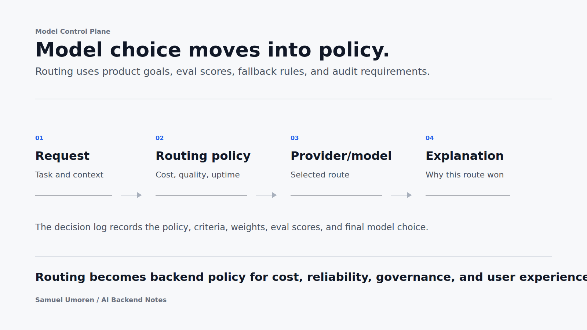

Merge Gateway's [routing policies](https://docs.merge.dev/merge-gateway/features/routing-policies/overview) move model selection into a policy layer. The policy routes requests based on goals like minimizing cost, maximizing uptime, or balancing cost and quality.

The intelligent routing flow is:

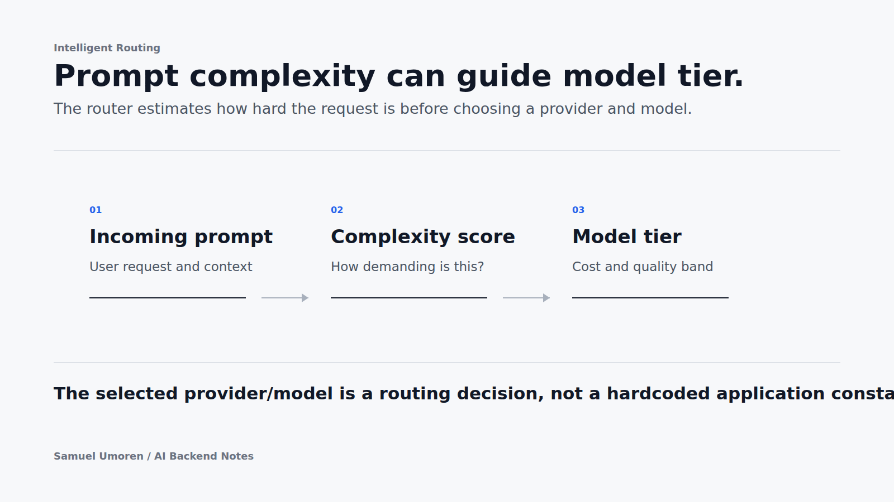

A routing policy can encode different choices for different workloads:

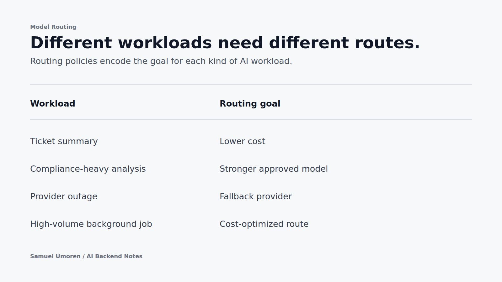

[Build Your Own Router](https://www.merge.dev/blog/gateway-build-your-own-router) adds a more explicit policy layer. Teams can define their own benchmarks, weights, and eval scores. They can decide what "best" means for their workloads.

Different products define "best" differently:

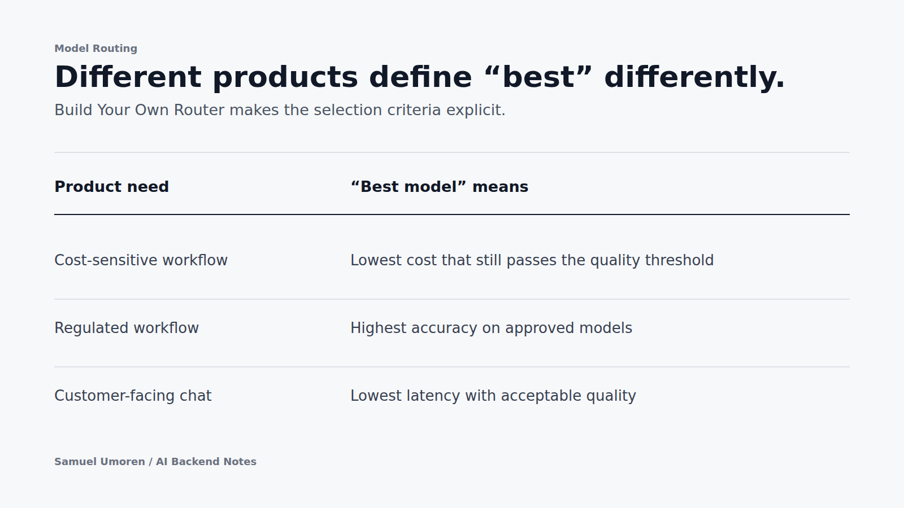

The routing decision also needs to be inspectable. A control plane records which model was chosen, why it won, which score dominated, and where the score came from.

That gives security and compliance teams a concrete artifact:

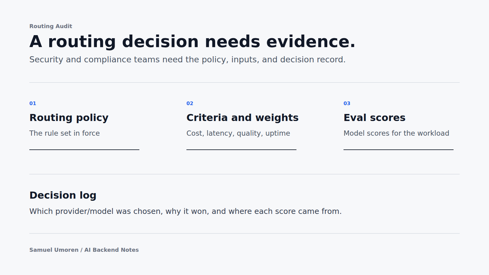

LLM routing is also an active systems research area. Papers like [RouteLLM](https://arxiv.org/abs/2406.18665) study how to route requests between cheaper and more capable models while preserving quality. The production version of this idea needs policies, logs, fallback behavior, cost visibility, and auditability.

Model choice becomes backend policy.

## The AI integration layer is the backend around the LLM

Put the sections together and the architecture becomes clear: the backend of an AI product has to run around the LLM, the agent, and the customer systems the agent touches.

The integration layer around an AI product carries three paths:

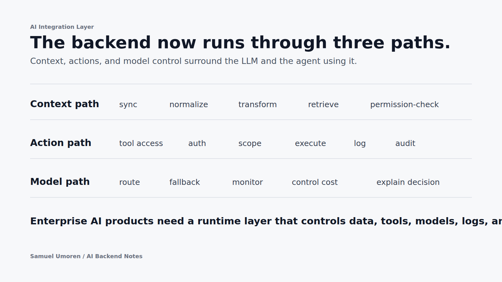

Those paths sit around the LLM and the agent using it. They decide which data enters the prompt, which actions the agent can take, which provider/model handles the request, and how the system records the result.

This is the backend shape forming around AI products.

Traditional backend responsibilities remain: auth, databases, APIs, permissions, queues, jobs, and business logic.

AI adds a backend surface for context, actions, models, observability, governance, cost, and auditability.

For backend developers, this is the architectural shift to understand: enterprise AI products need a runtime layer that controls data access, tool use, model choice, cost, logs, and auditability around every request.

## Sources

- Merge, [Introducing the new Merge](https://www.merge.dev/blog/the-new-merge)
- Merge docs, [Agent Handler overview](https://docs.merge.dev/merge-agent-handler/overview)
- Merge, [Knowledge Base Unified API announcement](https://www.merge.dev/blog/knowledge-base-unified-api-announcement)
- Merge, [How we build reliable MCP connectors](https://www.merge.dev/blog/how-we-build-mcp-connectors)
- Merge, [What are MCP connectors?](https://www.merge.dev/blog/mcp-connectors)
- Merge docs, [Gateway routing policies](https://docs.merge.dev/merge-gateway/features/routing-policies/overview)
- Merge, [Gateway Build Your Own Router](https://www.merge.dev/blog/gateway-build-your-own-router)
- Merge, [AI Data Transformations](https://www.merge.dev/blog/ai-data-transformations)
- Ong et al., [RouteLLM: Learning to Route LLMs with Preference Data](https://arxiv.org/abs/2406.18665)
